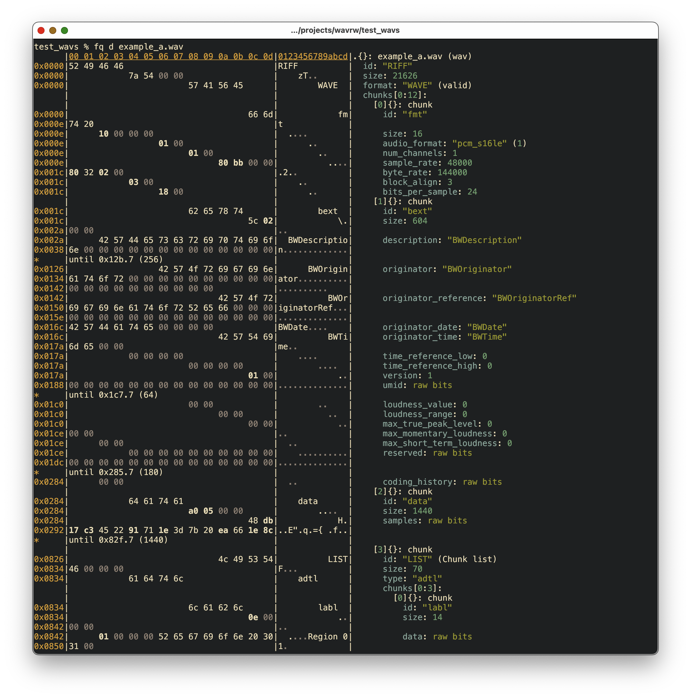

+++
title="'fq' is 'jq' for binary formats"
date=2024-03-15

[taxonomies] 
post_type=["TIL"]
[extra] 
summary="A command line tool for exploring, visualizing and parsing binary files." 
+++

Just started playing with `fq` a "jq for binary files": [https://github.com/wader/fq/](https://github.com/wader/fq/) ([`jq`](https://jqlang.github.io/jq/) is a command line tool for parsing and manipulating JSON documents)

It's a command line tool for exploring, visualizing and parsing binary files.

Initial impression is *really* positive. Look at this lovely breakdown of the details of a WAVE file. Like most tools it doesn't parse most metadata chunks, but it gives a really clear view of the structure of the chunks in a file, and at least which chunks are in a file.

